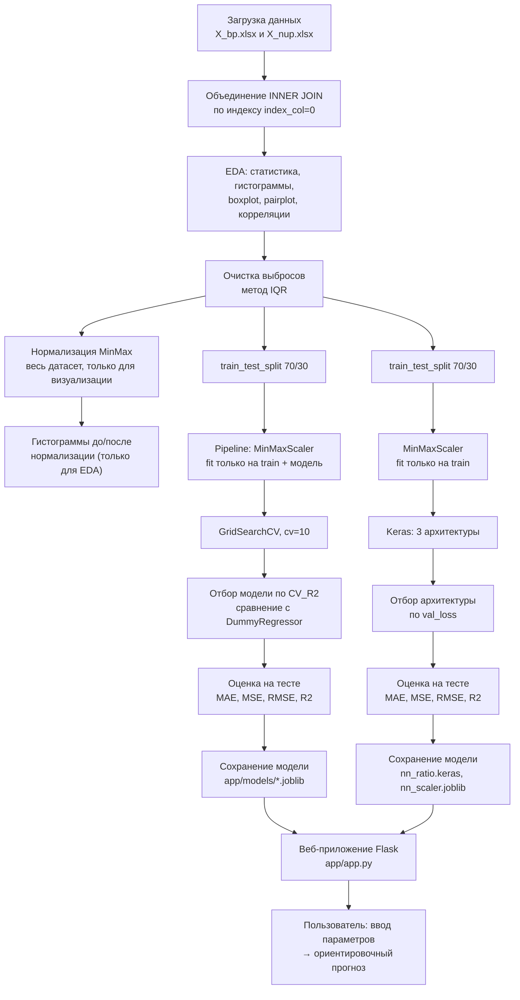

# Прогнозирование свойств полимерного композиционного материала

Выпускная квалификационная работа (ВКР): анализ данных и модели машинного
обучения для прогнозирования механических свойств полимерного композита на
основе технологических параметров производства, а также веб-приложение для
интерактивного прогноза.

## 1. Описание проекта

Работа решает три задачи:

1. **Разведочный анализ данных (EDA)** — загрузка, объединение, статистика,
   визуализация, очистка от выбросов и нормализация исходных данных.
2. **Модели машинного обучения** — прогноз двух целевых показателей:
   - «Модуль упругости при растяжении, ГПа»;
   - «Прочность при растяжении, МПа».
   Для каждого показателя строится отдельная модель.
3. **Нейронная сеть (Keras)** — прогноз показателя «Соотношение
   матрица-наполнитель» (постановка обратного проектирования: сеть получает
   на вход в том числе желаемые механические свойства и предсказывает
   технологический параметр, который к ним приводит).

Результат — веб-приложение на Flask, позволяющее ввести параметры материала
и получить прогноз всех трёх показателей.

## 2. Датасет

Исходные данные — два файла:

- `data/X_bp.xlsx`;
- `data/X_nup.xlsx`.

Файлы объединяются по индексу через **INNER JOIN** (`index_col=0`), что даёт
итоговую таблицу с 13 столбцами (12 признаков + технологические/механические
показатели, используемые как признаки или цели в зависимости от задачи).
После очистки выбросов методом IQR в обучающей таблице (`data/processed/data_clean.csv`)
остаётся **1023 наблюдения**.

## 3. Структура проекта

```
VKR_composites/
├── app/
│   ├── app.py                # Flask-приложение
│   ├── models/                # обученные модели (joblib, keras)
│   ├── static/style.css       # стили интерфейса
│   └── templates/index.html   # HTML-шаблон
├── data/
│   ├── X_bp.xlsx, X_nup.xlsx   # исходные данные
│   └── processed/              # данные после очистки и нормализации
├── notebooks/
│   ├── 01_EDA.ipynb            # Блок 1: разведочный анализ
│   ├── 02_models.ipynb         # Блок 2: модели ML
│   └── 03_neural_network.ipynb # Блок 3: нейронная сеть
├── figures/                    # графики (PNG, 300 dpi) и таблицы метрик (CSV)
├── scripts/                    # вспомогательные скрипты генерации ноутбуков/графиков
├── requirements.txt
└── README.md
```

## 4. Методология

- Разбиение выборки: `train_test_split(test_size=0.3, random_state=42)`.
- Подбор гиперпараметров: `GridSearchCV` с `cv=10`.
- **Отбор лучшей модели выполняется только по результатам кросс-валидации**
  (`CV_R2`, средний R² по 10 фолдам на обучающей выборке), а не по тестовой
  выборке — тест используется исключительно для финальной, информационной
  оценки уже выбранной модели. Из кандидатов исключаются `DummyRegressor`
  (базовая линия) и модели с вырожденным (фактически постоянным) прогнозом
  на тесте.
- Для каждой задачи в сравнение обязательно включён `DummyRegressor`
  (baseline).
- Метрики MAE, MSE, RMSE и R² рассчитываются на train и на test и сохраняются
  без каких-либо корректировок.
- Все графики — на русском языке, сохранены в `figures/` в формате PNG,
  300 dpi.

## 5. Основные результаты

### 5.1 Модуль упругости при растяжении, ГПа

Источник: `figures/metrics_modulus.csv`.

| Модель | CV_R2 | MAE_test | RMSE_test | R2_test |
|---|---|---|---|---|
| DummyRegressor | -0.0305 | 2.3986 | 2.9607 | -0.0059 |
| Lasso | -0.0305 | 2.3986 | 2.9607 | -0.0059 |
| **SVR (лучшая)** | **-0.0329** | **2.3985** | **2.9496** | **0.0016** |
| Ridge | -0.0361 | 2.4003 | 2.9558 | -0.0026 |
| LinearRegression | -0.0600 | 2.4160 | 2.9573 | -0.0036 |
| GradientBoostingRegressor | -0.0762 | 2.3778 | 2.9501 | 0.0013 |
| RandomForestRegressor | -0.0881 | 2.4168 | 2.9707 | -0.0127 |
| DecisionTreeRegressor | -0.1340 | 2.4237 | 2.9868 | -0.0237 |
| KNeighborsRegressor | -0.1493 | 2.5057 | 3.0877 | -0.0940 |

Лучшая модель — `SVR(C=0.1)` (пайплайн `MinMaxScaler` + `SVR`), сохранена в
`app/models/best_model_modulus.joblib`.

### 5.2 Прочность при растяжении, МПа

Источник: `figures/metrics_strength.csv`.

| Модель | CV_R2 | MAE_test | RMSE_test | R2_test |
|---|---|---|---|---|
| **SVR (лучшая)** | **-0.0277** | **361.3425** | **459.6788** | **-0.0353** |
| DummyRegressor | -0.0278 | 361.3037 | 459.6448 | -0.0351 |
| Lasso | -0.0314 | 360.3063 | 458.4349 | -0.0297 |
| Ridge | -0.0357 | 359.8930 | 458.2153 | -0.0287 |
| LinearRegression | -0.0642 | 362.8546 | 461.9324 | -0.0454 |
| RandomForestRegressor | -0.0761 | 371.0440 | 463.8677 | -0.0542 |
| GradientBoostingRegressor | -0.0874 | 365.7619 | 462.0801 | -0.0461 |
| DecisionTreeRegressor | -0.1198 | 376.5944 | 470.9421 | -0.0866 |
| KNeighborsRegressor | -0.1315 | 376.9503 | 485.1733 | -0.1533 |

Лучшая модель — `SVR(C=0.1)`, сохранена в `app/models/best_model_strength.joblib`.

### 5.3 Соотношение матрица-наполнитель (нейронная сеть)

Источник: `figures/metrics_nn.csv`.

| Модель | MAE_train | RMSE_train | R2_train | MAE_test | RMSE_test | R2_test |
|---|---|---|---|---|---|---|
| Нейронная сеть (32-16) | 0.7152 | 0.8910 | 0.0235 | 0.7012 | 0.8787 | -0.0137 |
| Baseline (среднее по train) | 0.7258 | 0.9017 | 0.0000 | 0.6942 | 0.8734 | -0.0016 |

Архитектура 32-16 (с `Dropout(0.2)` и `EarlyStopping`) выбрана среди трёх
сравнивавшихся архитектур по минимальному `val_loss`. Модель сохранена в
`app/models/nn_ratio.keras`, скейлер признаков — в `app/models/nn_scaler.joblib`.

### 5.4 Честная интерпретация результатов

**Ни одна из моделей не превосходит наивный baseline (`DummyRegressor` /
среднее по train) на кросс-валидации и на тесте.** Значения `CV_R2`
отрицательны или близки к нулю для всех целевых показателей — это означает,
что доступные признаки в данном датасете практически не объясняют изменения
целевых величин линейными или нелинейными зависимостями, которые удалось
найти рассмотренным моделям. Результаты сохранены и представлены без
приукрашивания, как того требует методология работы. Веб-приложение явно
предупреждает пользователя об этом ограничении при каждом прогнозе.

## 6. Блок-схема процесса

Сохранена также как изображение: `figures/flowchart.png` (300 dpi).



## 7. Установка и запуск

### 7.1 Установка

```bash
python -m venv .venv
.venv\Scripts\activate        # Windows
pip install -r requirements.txt
```

### 7.2 Запуск ноутбуков

```bash
.venv\Scripts\jupyter notebook notebooks/
```

Порядок выполнения: `01_EDA.ipynb` → `02_models.ipynb` → `03_neural_network.ipynb`.
Каждый ноутбук сохраняет графики в `figures/` и (Блоки 2–3) обученные модели
в `app/models/`.

### 7.3 Запуск веб-приложения

```bash
.venv\Scripts\python app\app.py
```

Приложение будет доступно на `http://127.0.0.1:5000/`. Интерфейс содержит
две вкладки:

- **«Прогноз свойств»** — 11 входных параметров → прогноз модуля упругости
  и прочности при растяжении;
- **«Рекомендация соотношения»** — 12 входных параметров → прогноз
  соотношения матрица-наполнитель (нейронная сеть).

Значения по умолчанию — медианы обучающей выборки
(`data/processed/data_clean.csv`). Приложение проверяет, что введённые
значения числовые, и предупреждает, если они выходят за диапазон
[минимум; максимум] обучающих данных.

## 8. Ограничения

- Качество моделей ограничено: на кросс-валидации `CV_R2` близок к нулю или
  отрицателен для всех целевых показателей — датасет, по всей видимости, не
  содержит признаков с достаточной прогностической силой для данных целей.
- Тестовая выборка (около 281–307 наблюдений в зависимости от задачи)
  ограничена по размеру, поэтому финальные метрики на тесте носят
  информационный характер и не использовались для выбора модели.
- Прогнозы приложения являются ориентировочными и не заменяют лабораторные
  испытания материала.
